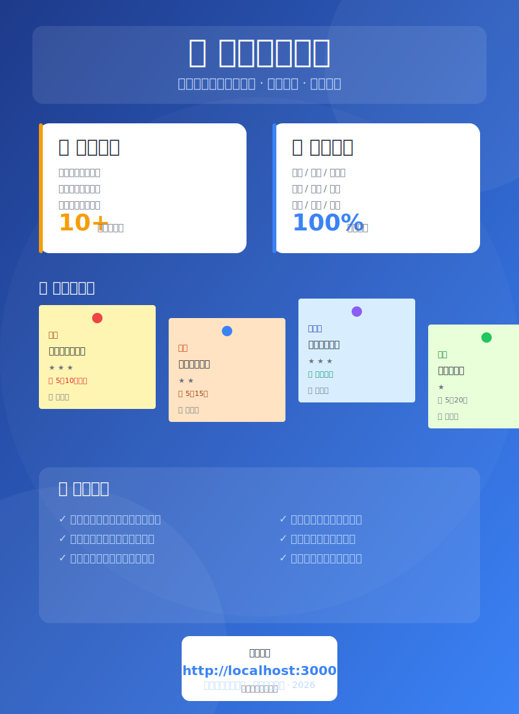

# 学院通知看板
## 宣传手册

---



---

## 一、产品简介

学院通知看板是一款面向全院教职工的通知管理工具，旨在解决微信群通知信息碎片化、查找困难、易遗漏等问题。

**核心价值：** 从微信群消息中自动提取通知，以直观的便签式看板展示，支持分类、筛选、搜索、附件等功能。

---

## 二、功能亮点

### 📋 智能解析
粘贴微信群通知文本，系统自动识别：
- 通知类型（科研、教学、研究生、学工、人事、保密、国资、安全、国合、全院等）
- 重要性等级（高中低）
- 关键信息（发布时间、截止日期、负责人、联系方式）
- 相关链接和附件

### 🏷️ 分类管理
支持 10+ 种通知类型，每种类型有独特的颜色标识：

| 类型 | 颜色 | 适用场景 |
|------|------|----------|
| 科研 | 🟡 橙黄 | 基金申报、项目通知 |
| 教学 | 🟠 橙色 | 课程安排、毕设答辩 |
| 研究生 | 🔵 蓝色 | 导师培训、学位申请 |
| 学工 | 🟢 绿色 | 奖学金、评优评先 |
| 人事 | 🟣 紫色 | 招聘、职称评审 |
| 保密 | 🔴 红色 | 涉密通知 |
| 国资 | 🟣 紫罗兰 | 设备采购、招标 |
| 安全 | 🟡 黄色 | 消防培训、应急通知 |
| 国合 | 🔵 青色 | 出国出境、国际交流 |
| 全院 | ⚪ 灰色 | 院级通知、会议 |

### 📌 便签式看板
- 瀑布流布局，信息一目了然
- 随机微旋转，视觉更有趣
- 过期通知自动变灰标记

### ⏰ 截止日期提醒
- 相对时间显示（"3天后截止"）
- 颜色警示（红色=紧急，黄色=临近）
- 过期自动标记

### 🔍 搜索与筛选
- 支持标题、正文、负责人全文搜索
- 点击类型标签快速筛选
- 多种排序方式（重要性、截止日期、发布时间）

### 📎 附件支持
- 支持上传常见格式（PDF、Word、Excel、PPT、图片等）
- 附件直接显示在通知卡片上
- 点击即可下载

### 💾 数据管理
- 一键导出 JSON 格式备份
- 支持导入恢复数据
- 管理员密码保护

---

## 三、使用指南

### 访问方式
在浏览器中打开：**http://localhost:3000**

> 提示：在校园网或同一局域网环境下均可访问

### 游客模式 vs 管理员模式

| 功能 | 游客模式 | 管理员模式 |
|------|----------|------------|
| 查看通知 | ✅ | ✅ |
| 搜索筛选 | ✅ | ✅ |
| 添加通知 | ❌ | ✅ |
| 编辑删除 | ❌ | ✅ |
| 上传附件 | ❌ | ✅ |
| 修改密码 | ❌ | ✅ |

### 添加新通知

1. 点击右上角 **"+ 添加通知"** 按钮
2. 在文本框中粘贴微信群通知内容
3. 系统实时显示**解析预览**（类型、重要性、负责人、截止日期等）
4. 如有附件，点击 **"📎 添加附件"** 选择文件
5. 确认无误后点击 **"解析添加"**

**示例输入：**
```
【科研项目申报-05.10】关于组织申报2026年度科技厅基础研究计划项目的通知

请各课题组抓紧时间申报，截止日期为5月10日。

负责人：张老师
邮箱：test@nuaa.edu.cn
```

**系统将自动解析：**
- 类型：科研
- 重要性：高（包含"截止"关键词）
- 截止日期：2026-05-10
- 负责人：张老师
- 链接：自动提取邮箱

### 修改通知

1. 在通知卡片上点击 **"编辑"** 按钮
2. 修改相关信息（标题、类型、重要性、截止日期等）
3. 点击 **"保存修改"**

### 删除通知

1. 在通知卡片上点击 **"删除"** 按钮
2. 确认删除操作

### 导出/导入数据

在管理面板中：
- **"📤 导出数据"**：下载所有通知为 JSON 文件
- **"📥 导入数据"**：选择 JSON 文件批量导入

### 修改管理员密码

1. 进入管理面板
2. 找到 **"🔐 修改管理员密码"** 区域
3. 输入原密码和新密码
4. 点击 **"确认修改"**

> 密码要求：至少8位，包含大小写字母、数字和特殊字符

---

## 四、适用场景

### 场景一：行政办公室
- 集中管理各类通知
- 重要事项置顶提醒
- 附件统一管理

### 场景二：系部秘书
- 追踪教学、科研通知
- 整理会议纪要
- 提醒教师关键节点

### 场景三：辅导员
- 管理学工通知
- 奖学金评定追踪
- 学生事务提醒

### 场景四：课题组长
- 跟踪项目申报
- 会议通知提醒
- 组内任务分配

---

## 五、技术规格

| 项目 | 说明 |
|------|------|
| 访问地址 | http://localhost:3000 |
| 推荐浏览器 | Chrome、Firefox、Edge、Safari |
| 数据存储 | 本地 JSON 文件 |
| 支持格式 | PC、手机、平板 |
| 附件限制 | 单文件大小建议 < 50MB |

---

## 六、常见问题

**Q: 如何设置管理员密码？**
A: 首次使用时，默认密码为 `ChangeMe@2024`，可在管理面板中修改。

**Q: 数据存储在哪里？**
A: 通知数据存储在服务器的 `data/notices.json` 文件中，附件存储在 `uploads/` 目录。

**Q: 如何实现多用户协作？**
A: 当前版本为本地部署，建议通过局域网共享或定期导出导入实现数据同步。

**Q: 支持微信群消息直接推送吗？**
A: 可通过企业微信/飞书机器人 Webhook 实现自动推送（需额外配置）。

---

## 七、联系方式

如有问题或建议，请联系系统管理员。

---

*南京航空航天大学 · 学院通知看板 · 2026*
